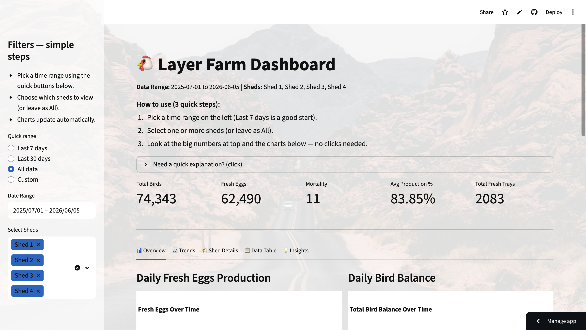
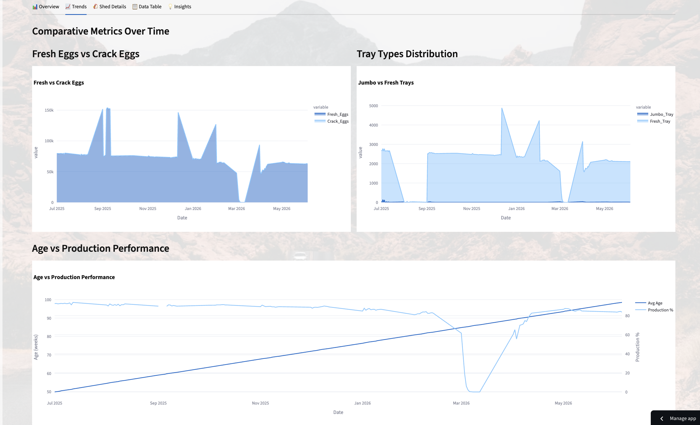
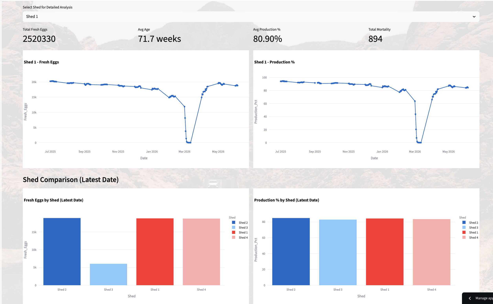

# VSF Farm Analytics Platform

## Overview

VSF Farm Analytics Platform is a data analytics solution built for a commercial layer poultry farm with a capacity of approximately 92,000 birds and a daily production of 80,000+ eggs.

The project transforms raw farm operational data maintained in spreadsheets into analytics-ready datasets, interactive dashboards, and actionable business insights.

The goal is to help farm owners and managers monitor production performance, mortality trends, shed-wise efficiency, and overall farm operations through a centralized dashboard.

---

## Business Problem

Commercial poultry farms generate large volumes of operational data every day, including:

* Bird population
* Egg production
* Mortality
* Crack eggs
* Leaker eggs
* Production percentage
* Shed-wise performance

This data is often stored in spreadsheets and reviewed manually, making it difficult to identify trends, anomalies, and performance issues in a timely manner.

---

## Solution

The platform automates the transformation of raw farm data into structured analytical datasets and provides an interactive dashboard for monitoring key farm KPIs.

Key capabilities include:

* Daily production monitoring
* Shed-wise performance analysis
* Mortality tracking
* Egg quality monitoring
* Historical trend analysis
* Executive-level KPI dashboard

---

## Architecture

Google Sheets / Excel Reports

↓

Python ETL Pipeline

↓

Pandas Data Processing

↓

Analytics Dataset

↓

Streamlit Dashboard

↓

Business Insights

---

## Features

### Production Analytics

* Daily egg production tracking
* Production percentage monitoring
* Historical production trends

### Mortality Monitoring

* Daily mortality analysis
* Shed-level mortality comparison
* Trend identification

### Shed Performance Analysis

* Compare production across sheds
* Identify best and worst performing sheds
* Operational benchmarking

### Executive Dashboard

* Total birds
* Total eggs produced
* Production percentage
* Mortality metrics
* Operational KPIs

---

## Technology Stack

* Python
* Pandas
* Streamlit
* OpenPyXL
* Git
* GitHub

---

## Dashboard Preview

### Overview Dashboard

### Production Trends

### Shed Analysis

---

## Live Demo

https://vsfanalytics.streamlit.app/

---

## Future Enhancements

### Phase 2

* Automated Google Sheets ingestion
* Historical trend reporting
* Advanced KPI calculations
* Alert generation for anomalies

### Phase 3

* Tally integration
* Feed cost analytics
* Revenue and profitability dashboards
* Financial reporting

### Phase 4

* AI-powered farm assistant
* Natural language querying
* Production forecasting
* Mortality prediction
* Operational recommendations

---

## Project Status

Current Version: V1

Completed:

* Data extraction and transformation pipeline
* Analytics-ready data model
* Streamlit dashboard deployment
* Cloud hosting

Planned:

* Multi-month historical analytics
* Automated data refresh
* Financial analytics integration
* AI-powered insights
